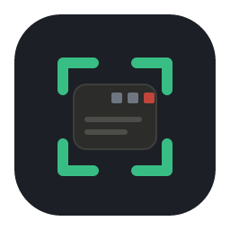

# kvscf — VS Code Focuser

A small Windows app that scans your open **VS Code** / **VS Code Insiders** windows, lists them sorted
and labeled, and brings the one you click to the foreground. If you keep a dozen-plus editor windows
open — local and Remote-SSH — it turns "hunt through the taskbar thumbnails" into a one-click pick
(in my day-to-day, ~5–12s of squinting down to about a second).

## What it does

- **Lists every open VS Code / Insiders window** — one row each as `workspace (host)`: the name is
  colored by build (Insiders vs. stable) and bold, the remote host is muted italics. Sorted by name; a
  long name truncates but the host is always kept.
- **Click to focus** — reliably foregrounds the exact window, even when it's minimized or buried.
- **Two window modes** — a normal floating window, or an **AppBar "dock"** that reserves a screen edge
  like the taskbar, so maximized windows don't cover it.
- **Update Assist** — one button for the near-daily VS Code Insiders update dance: close all but one
  window per remote host, run the update, then relaunch the rest.
- **Remote mode (optional)** — publishes the window list to a Redis feed that a
  [kdeskdash](https://github.com/kenhia/kdeskdash) touch panel renders; tap a window there to bring it
  forward on your PC.

## Using it yourself

kvscf is built for my homelab — the kdeskdash remote feature especially — but the core (list + focus
your editor windows) works as-is for any Windows + VS Code / Insiders user who opens one too many
instances.

- **Just the window switcher?** Build **`kvscf-local`** ([below](#build)). It compiles the
  remote/dashboard code out entirely — no Redis, no config, nothing to set up.
- **Want the VIP experience?** The full `kvscf` build publishes your window list to a Redis feed that
  [kenhia/kdeskdash](https://github.com/kenhia/kdeskdash) renders on a Raspberry Pi touch panel — tap a
  window on the panel to foreground it on your PC. That side takes some customization for your
  environment, but it's quick with an agent's help.

## Build

Requires the Rust toolchain (MSVC) on Windows.

```sh
# Window switcher only — no remote/dashboard code compiled in:
cargo build --release -p kvscf-local
#   -> target/release/kvscf-local.exe

# Full build — includes the kdeskdash remote feature:
cargo build --release -p kvscf

# Core CLI (list / focus without the GUI):
cargo run -p kvscf-core --bin kvscf-core -- list
cargo run -p kvscf-core --bin kvscf-core -- focus <hwnd>
```

> **Note:** build `kvscf-local` in isolation (`-p kvscf-local`). A whole-workspace build unifies Cargo
> features and would pull the remote code back in. `kvscf-local --build-info` prints `remote=false` to
> confirm you've got the comms-free binary.

## Configuration (full build only)

Remote mode needs a Redis endpoint and a shared token (`KVSCF_TOKEN`), read from
`HKCU\Software\kenhia\kvscf` (preferred) or a `.env`. The wire contract is in
[docs/kdeskdash-vscode-mode.md](docs/kdeskdash-vscode-mode.md); how it all fits together is in
[docs/architecture.md](docs/architecture.md). `kvscf-local` needs none of this.

## How it's organized

- `kvscf-core` — enumerate / parse / focus (+ a small CLI)
- `kvscf-app` — the nav-rail app; the `remote` feature gates the kdeskdash channel
- `kvscf` — full binary · `kvscf-local` — no-comms binary

Design notes are in [PLAN.md](PLAN.md) and [docs/architecture.md](docs/architecture.md); it was built in
four sprints, documented under [`sprints/`](sprints/).

## License

MIT — see [LICENSE](LICENSE).
