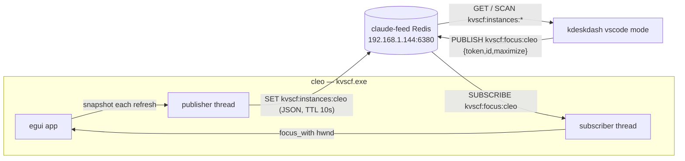

# kvscf architecture

How the pieces fit and the mechanics behind the contracts. See [PLAN.md](../PLAN.md) for the
original design rationale and `sprints/` for the sprint-by-sprint story.

## Crates

```
kvscf-core   library — enumerate / parse / focus VS Code windows (+ a small list/focus CLI)
kvscf-app    library — the nav-rail egui app. Feature `remote` (default) gates the kdeskdash channel.
kvscf        binary  — full build (remote on).
kvscf-local  binary  — no-comms build for kwork (remote off; excluded from default-members).
```

`kvscf` and `kvscf-local` are thin `fn main()` shells over `kvscf_app::run()`; the only difference is
whether the `remote` feature (and its deps: `redis`, `serde_json`, `dotenvy`) are compiled in. Because a
whole-workspace build unifies features, the comms-free artifact must be built **in isolation**:
`cargo build --release -p kvscf-local` (CI asserts `--build-info` → `remote=false`). See WI #471.

## Core mechanics (`kvscf-core`)

1. **Enumerate** — `EnumWindows` walks every top-level window; keep the visible, titled ones whose
   process image is `Code.exe` / `Code - Insiders.exe`. (One VS Code process hosts many windows, so
   `Get-Process` is insufficient — hence raw `EnumWindows`.)
2. **Parse** — the window title → `Instance { hwnd, app, workspace, remote, active_file, z_index }`.
   The appName (`Visual Studio Code[- Insiders]`) is stripped first (it contains the `" - "` separator),
   then the remote tag (`[SSH: host]` etc.) is pulled out of the workspace name.
3. **Focus** — `focus_with(hwnd, maximize)`: attach to the current foreground thread, un-minimize only
   if needed (never un-maximize — WI #465), `SetForegroundWindow` + `BringWindowToTop`, detach. Bare
   `SetForegroundWindow` is unreliable; the `AttachThreadInput` recipe is what makes it land, even when
   called from a background thread (the remote focus path relies on this).

## The app (`kvscf-app`)

A tall/thin egui "nav rail" listing open windows, sorted by lowercased name; click a row → `focus_with`.
Two window modes:

- **Floating** (default) — normal, resizable, not always-on-top, geometry persisted. Optional
  "auto-hide after focus" self-minimizes ~2s after a click.
- **Docked** (WI #468) — a Windows **AppBar** reserving the primary monitor's left edge, so maximized
  windows don't cover it (like the taskbar). Borderless + always-on-top; `SHAppBarMessage`
  ABM_NEW/QUERYPOS/SETPOS, re-asserted ~1s, removed on exit.

Settings (`maximize_on_focus`, `auto_hide`, `docked`) persist to `HKCU\Software\kenhia\kvscf`; a named
mutex enforces a single instance.

## Remote channel (`remote` feature) ↔ kdeskdash

The channel talks to the kdeskdash desk dashboard over the shared **"claude-feed" Redis** at
`192.168.1.144:6380` (rpidash2; LAN, no Redis auth, ephemeral: 32mb / allkeys-lru / no persistence).
Redis being open, the app-level **`KVSCF_TOKEN`** gates the only action — the focus command. The token
is read from **`HKCU\Software\kenhia\kvscf` (preferred)**, falling back to env / a `.env` file (cwd or
next to the exe) — the registry path is robust to where the exe is launched from (a pinned launch from
`C:\tools\bin` has no cwd/exe-dir `.env`). Endpoint host/port take env overrides, else the pinned
rpidash2 defaults.



- **Publisher thread** — on every app refresh (~1s) the app hands the current `Vec<Instance>` to the
  publisher over an mpsc; it `SET`s `kvscf:instances:<host>` to the JSON list with a 10s TTL (so a dead
  publisher ages out). Backlog is collapsed to the latest snapshot; Redis errors trigger reconnect.
- **Subscriber thread** — `SUBSCRIBE kvscf:focus:<host>`; each message is JSON-parsed, the token checked
  against `KVSCF_TOKEN`, then `focus_with(hwnd, maximize)` runs (background-thread foreground).

The wire contract (keys, fields, payloads) is specified for the kdeskdash side in
[kdeskdash-vscode-mode.md](kdeskdash-vscode-mode.md).

## Window sets & Update Assist (`winset`)

`kvscf-app::winset` resolves each open window to its **full folder URI** by matching (workspace basename
+ remote host + build) against VS Code's own `workspaceStorage/*/workspace.json` (most-recent `mtime`
wins). That URI is what gets relaunched — a local `code`/`code-insiders --folder-uri <uri>` (kvscf runs
on cleo, so no krcmd round-trip).

- **Save / Restore** (WI #469): persist the resolved set as `%APPDATA%\kvscf\sets\last.json`; Restore
  relaunches it (staggered).
- **Update Assist** (WI #470): a bottom-panel flow for the near-daily Insiders remote-update dance —
  **Close Extras** keeps one window per (remote host × build) and closes the rest
  (`kvscf-core::close_window` = `WM_CLOSE`; locals untouched, survivor = most-recently-active); you run
  the update(s); **Relaunch** reopens the closed set, staggered.

Both live in the app library, so they work in `kvscf` and `kvscf-local` alike.

## kwork build

`kvscf-local` compiles with `remote` off — the entire `remote` module and its deps are absent from the
binary, so the work machine's copy contains no communication code at all.
